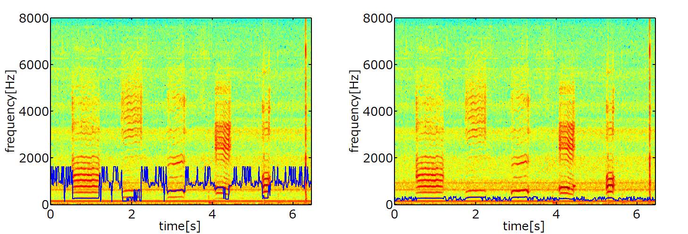

# 第四回B4輪講課題

## 課題の概要

本課題では，基本周波数の推定とスペクトル包絡の計算を行う．

## 課題

1. 基本周波数を推定してみよう！
  - 自己相関法で求めてみよう！
  - ケプストラム法で求めてみよう！
2. スペクトル包絡を抽出してみよう！
  - ケプストラムから推定してみよう！
  - LPCを用いて抽出してみよう！
3. 推定した基本周波数，スペクトル包絡をプロットしよう．

## 課題の進め方

1. 音声ファイルの準備
  - 第一回の課題で用いたファイルなど
2. 基本周波数（F0）の推定
  - 自己相関法，ケプストラム法で推定
  - 結果の比較
3. 基本周波数のプロット
  - F0系列のプロット
  - スペクトログラムに重ねられるとおしゃれ
4. スペクトル包絡の抽出
  - ケプストラム，LPCからスペクトル包絡を抽出
5. スペクトル包絡のプロット
  - スペクトルと併せて表示
6. 発表（次週）
  - 取り組んだ内容を周りにわかるように説明
  - 発表者は当日にランダムに決めるので**スライドは全員準備**
  - 結果の考察
  - 発表資料は研究室NASにアップロードしておくこと `\\\procyon\\all\\発表資料\B4輪講\\2022\\<発表日>`

## 結果例




## ヒント

- 係数行列がテプリッツ行列のときの連立一次方程式はLevinson-Durbinアルゴリズムで効率よく解ける
  - まずは`scipy.linalg.solve_toeplitz`を使用
  - できたらLevinson-Durbinアルゴリズムを実装
  - 実行時間の比較をしてみましょう！

- 処理時間を意識しましょう
  - どれだけ高速化できたか，`scipy`の実装にどれだけ近づけたか
  - pythonで実行時間を測定する方法は[こちら](http://st-hakky.hatenablog.com/entry/2018/01/26/214255)

## 注意

- 武田研究室の場合はセットアップで作成した`virtualenv`環境を利用すること  
   - アクティベート例：`source ~/workspace3/myvenv/bin/activate`  
   - アクティベート後`pip install ...`でライブラリのインストールを行う  
- 自分の作業ブランチで課題を行うこと
- 作業前にリポジトリを最新版に更新すること

```
$ git checkout master
$ git fetch upstream
$ git merge upstresam/master
```
