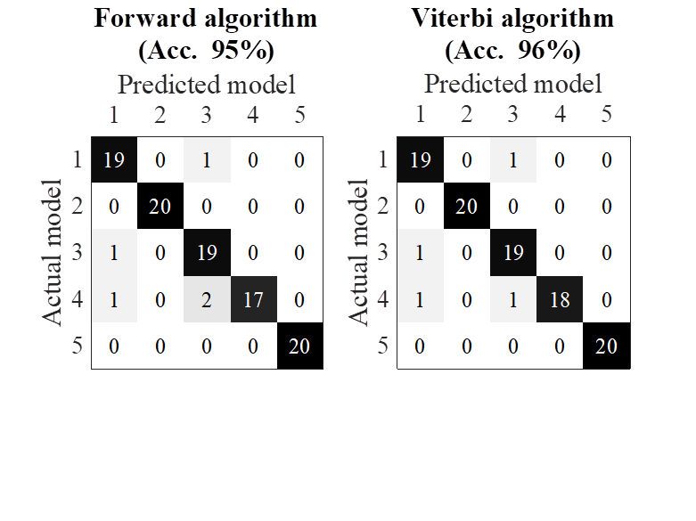

<script type="text/javascript" async src="https://cdnjs.cloudflare.com/ajax/libs/mathjax/2.7.7/MathJax.js?config=TeX-MML-AM_CHTML">
</script>
<script type="text/x-mathjax-config">
 MathJax.Hub.Config({
 tex2jax: {
 inlineMath: [['$', '$'] ],
 displayMath: [ ['$$','$$'], ["\\[","\\]"] ]
 }
 });
</script>
# 第八回B4輪講課題

## 課題の概要

本課題では，モデルの予測を行う．

## 課題

データからモデルを予測してみよう！

## 課題の進め方

- データの読み込み
  - 必要なデータはpickleで配布する
  - 読み込み方法や階層構造はヒントを参照
- 出力系列の尤度を計算
  - ForwardアルゴリズムとViterbiアルゴリズムを実装
  - 出力系列ごとにどのモデルから生成されたか推定
- 正解ラベルと比較
  - 混同行列 (Confusion Matrix) を作成
  - 正解率 （Accuracy） を算出
  - アルゴリズムごとの計算時間を比較
- 発表 （次週）
  - 取り組んだ内容を周りにわかるように説明
  - コードの解説
    - 工夫したところ，苦労したところの解決策はぜひ共有しましょう
  - 発表者は当日にランダムに決めるので**スライドは全員準備**
  - 結果の考察，応用先の調査など
  - 発表資料は研究室NASにアップロードしておくこと (`/procyon/all/発表資料\B4輪講/2022/<発表日>`)

## ヒント

- pickleデータの読み込み

```python
import pickle

data = pickle.load(open("data1.pickle", "rb"))
```

pickleデータの中にはディクショナリ型でデータが入っている

- 前提
  - モデルが$k$個ある (それぞれ$m_0, m_1, ..., m_k$とする)
  - すべてのモデルは, $l$個の状態($s_0, s_1, ..., s_l$)と$n$個の出力記号($o_0, o_1, ..., o_n$)をもつ
  - 各モデルから, 時刻$0$から$t$までの状態遷移&出力をさせて, 長さが$t$となる出力系列を合計$p$個作る
  - その際, どの出力系列がどのモデルから生成されたかを記録しておく  
  <br>
- dataの階層構造

```
data #[次元数, 次元数, ...]
├─answer_models # 出力系列を生成したモデル（正解ラベル）[p,]
├─output # 出力系列 [p, t]
└─models # 定義済みHMM 
  ├─PI # 初期確率 [k, l, 1]
  ├─A # 状態遷移確率行列 [k, l, l]
  └─B # 出力確率 [k, l, n]
```

- 具体的な中身の例
  - answer_models = [1 3 3 4 0 2 4 ...] は, 「出力系列$0$は$m_1$から, 出力系列$1$は$m_3$から, 出力系列$2$は$m_3$から, ... 生成された」
  - output[0] = [0 4 2 ... 4 0 0] は, 「出力系列$0$の出力は$o_0, o_4, o_2, ..., o_4, o_0, o_0$」だった」
  - PI[0] = [[1] [0] [0]] は, $m_0$の初期確率, つまり「$m_0$の初期状態が$s_0$である確率が$1$, $s_1$の確率が$0$, $s_2$の確率が$0$」  
  <br>
- data1とdata3はLeft-to-Right HMM
- data2とdata4はErgodic HMM

## 結果例



## 余裕がある人は

- 出来る限り可読性，高速化を意識しましょう
  - 冗長な記述はしていませんか
  - for文は行列演算に置き換えることはできませんか
- 関数は一般化しましょう
  - 課題で与えられたデータ以外でも動作するようにしましょう
  - N次元の入力にも対応できますか
- 処理時間を意識しましょう
  - どれだけ高速化できたか，`scipy`の実装にどれだけ近づけたか
  - pythonで実行時間を測定する方法は[こちら](http://st-hakky.hatenablog.com/entry/2018/01/26/214255)

## 注意

- 武田研究室の場合はセットアップで作成した`virtualenv`環境を利用すること  
  - アクティベート例：`source ~/workspace3/myvenv/bin/activate`  
  - アクティベート後`pip install ...`でライブラリのインストールを行う  
- 自分の作業ブランチで課題を行うこと
- プルリクエストを送る前に[REVIEW.md](https://github.com/TakedaLab/B4Lecture/blob/master/REVIEW.md)を参照し直せるところは直すこと
- プルリクエストをおくる際には**実行結果の画像も載せること**
- 作業前にリポジトリを最新版に更新すること

```
$ git checkout master
$ git fetch upstream
$ git merge upstresam/master
```
